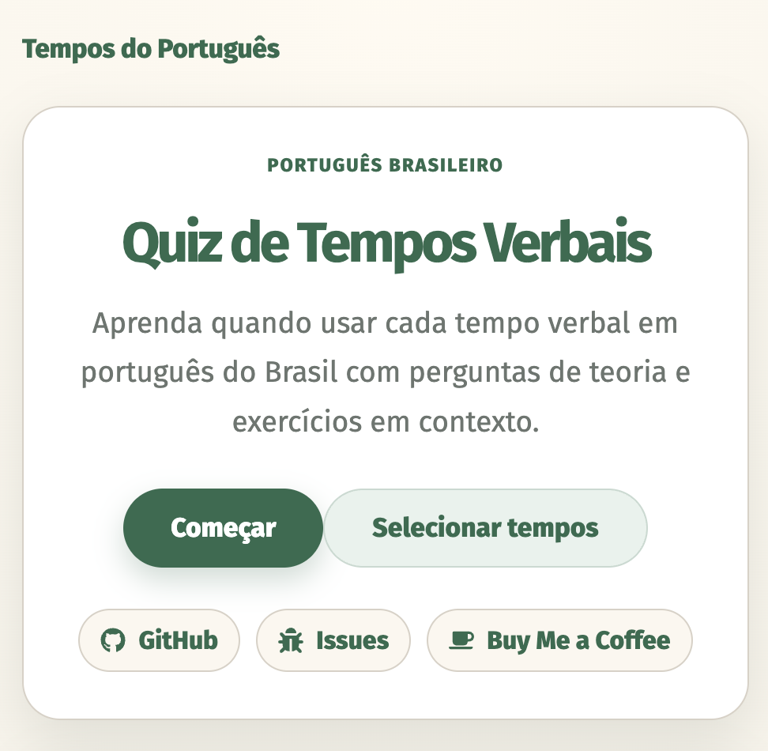
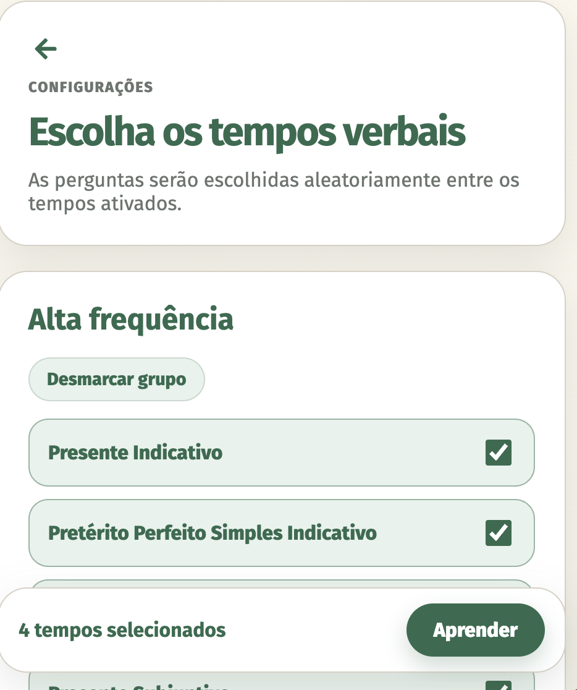
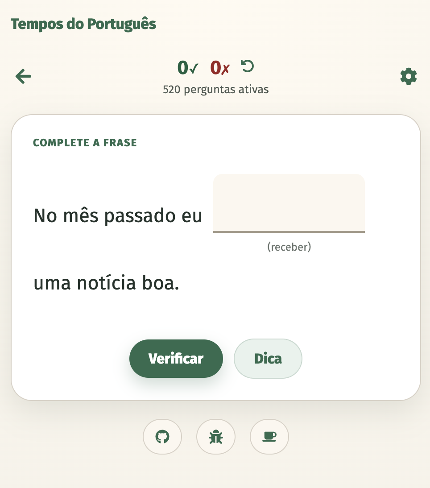
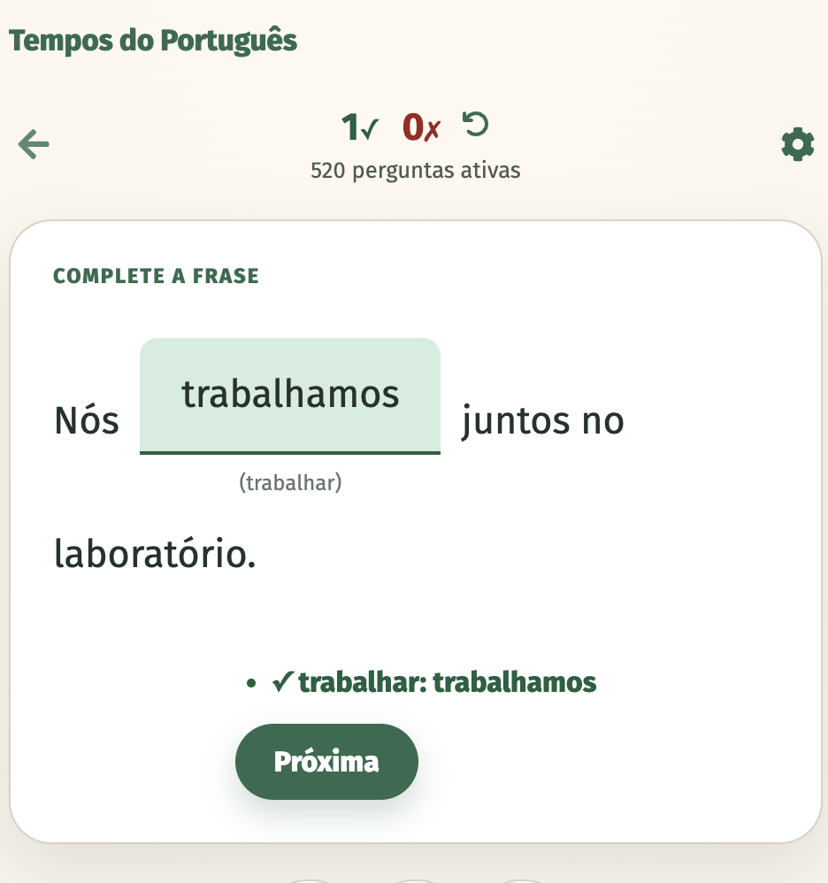
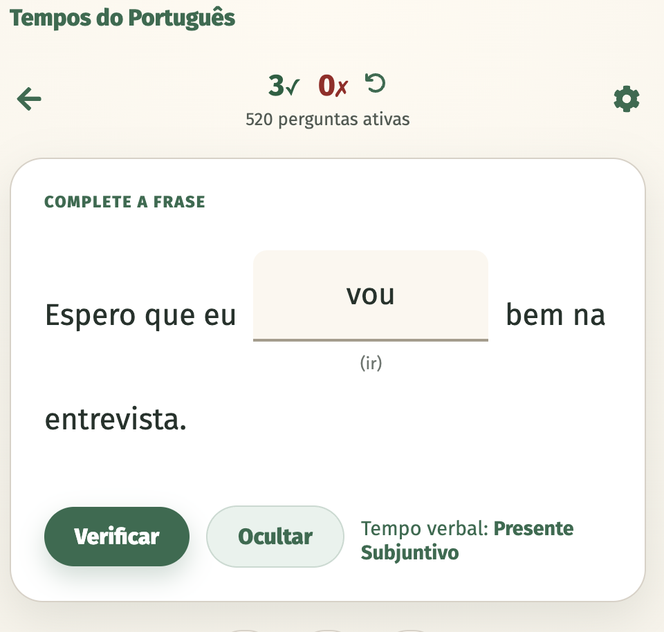
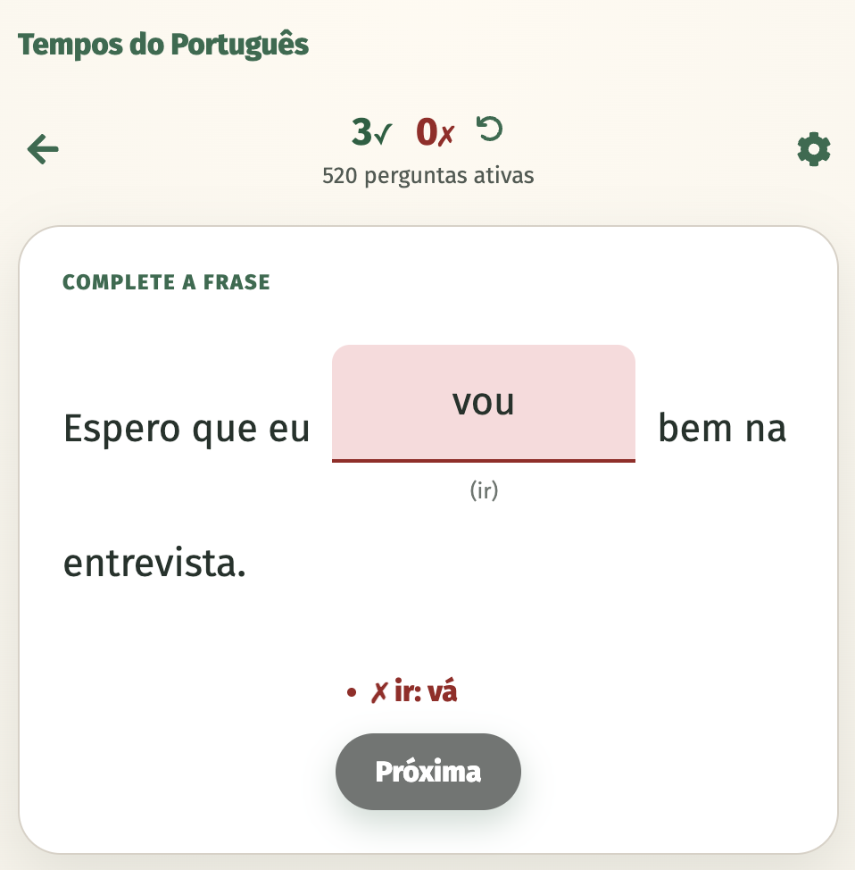
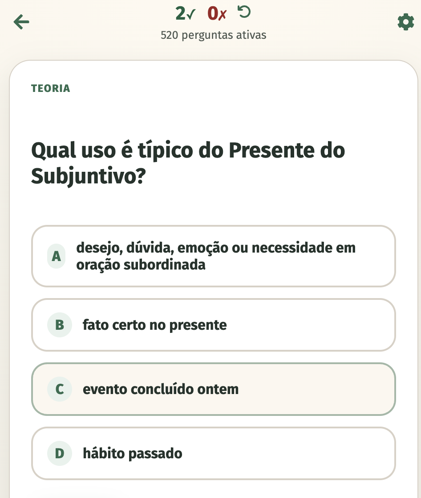

# Portuguese Tenses 🇧🇷

This is an application to learn basic portuguese tenses (brazilian variant) and how to use them. You can find the app online at [vercel](https://tempos-portugues.vercel.app/). The code is licensed with CC-BY-NC-SA 4.0 (see `license` file). If you want to add or support the development, just open an issue or merge request. 

If you like this app, you can [buy me a coffee](https://buymeacoffee.com/philkleer).

## Examples
Here you can see examples (Version: 1.0) of the screens:

  

   

   

## Available tenses

| Indicativo                  | Subjuntivo                  | Condicional                                   |
|-----------------------------|-----------------------------|-----------------------------------------------|
| Presente                    | Presente                    | Futuro do Pretérito Simples (Condicional I)   |
| Pretérito Perfeito Simples  | Pretérito Perfeito Simples  | Futuro do Pretérito Composto (Condicional II) |
| Pretérito Imperfeito        | Pretérito Imperfeito        |                                               |
| Pretérito Perfeito Composto | Pretérito Mais-Que-Perfeito |                                               |
| Pretérito Mais-que-Perfeito | Futuro Simples              |                                               |
| Futuro Simples              | Futuro Composto             |                                               |
| Futuro Composto             |                             |                                               |

## Question mode 

There are two question modes:

- Fill in: A practical example is given and you need to conjugate the verb correctly
- Theory: Question about the theoretical setting of the tense

## Want to help on this app? Or you have ideas?

Just make a branch of your own and create a [pull request](https://github.com/philkleer/portuguese-tenses-react/pulls). If you have just ideas, create an [issue](https://github.com/philkleer/portuguese-tenses-react/issues). I cannot guarantee that I have time to implement everything, since this is just a hobby.